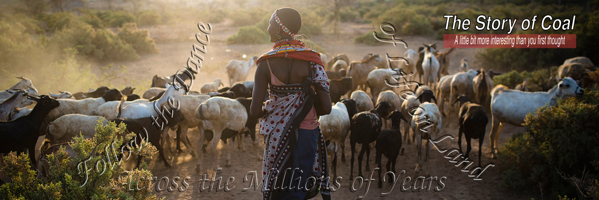

# *The Story-of-Coal*
A 21 Page Booklet which is *A Little Bit More Interesting Than You First Thought*

Above is a Dust-Cover for the Booklet.

I live on the East side of [Nottingham, England](https://www.openstreetmap.org/relation/123292), and there is a *Top Hard* Coal Seam that runs from the old [Gedling Pit](https://www.openstreetmap.org/way/352675979) under my house, continues under the centre of Nottingham and rises to the surface on the west of the city. When those west-side roads were being cut back in Victorian times to tarmac them the workers cut through the coal as they cut the turf (much to the delight of the locals, who got free coal for their fires).

[In the 1960s](https://www.openstreetmap.org/user/alexkemp/diary/39973) the last Pit Pony was retired, and in the 1980s *Gedling Colliery* (successor to *Digby Coal Company*) were making their final digs along *Top Hard*. They stopped several hundred feet immediately below close to where I sit right now, which was the line of [Dowson Street](https://www.openstreetmap.org/way/29991015) (the council forbad any digging under the city to prevent subsidence, and a pillar of coal had also been left below [Mapperley Lunatic Asylum](https://www.openstreetmap.org/way/216674163) for the same reason). In 1991 the colliery shut down.

So of course, coal has got the *Black Spot* upon it these days in more ways than one, but there are many interesting (some surprising) connections to the emergence of life on this planet between coal & everything else. Amongst the perennial questions are how on earth did 330 metres (1,100 feet) of coal build up to make a seam of coal in Australia? Why did it not rot away before being buried?

Main file: [the-story-of-coal.pdf](the-story-of-coal.pdf) (8.9 MiB)    
Produced using LibreOffice 7.4.5.1
Original research & writing by Alex Kemp    
Text available under [Creative Commons Attribution-ShareAlike License 4.0](https://creativecommons.org/licenses/by-sa/4.0/)

[Images dir](Images/): contains 21 x png / jpg / svg files used in the pdf    
[Tests dir](Tests/): contains 25 bash + ImageMagick command scripts used to produce 39 image files    
(*[mk-script-result](mk-script-result)* is the main bash script => [z003_result-script.jpg](Tests/z003_result-script.jpg))    
(these are IM6 scripts, and this dir is full of test scripts as I learnt IM6 for the first time)

*Added August 13:*    
 - An Alphabetical index has been added at the end of the booklet and thus it is now 23 pages long.    
I was disappointed to discover that, whilst page numbers get auto-added, no page-links can be provided.
 - A new text-file [howto-produce-an-alphabetical-index.txt](Tests/howto-produce-an-alphabetical-index.txt) has been added for those new to the above process (like me).
 - A new text-file [howto-produce-the 1st-page-oil-painting.txt](Tests/howto-produce-the-1st-page-oil-painting.txt) has been added for the benefit of the curious.

*Added September 12:*    
 - An internal link in the pdf was discovered to be wrong.    
 - All internal images were re-named as part of a comprehensive fix.
 - The single bad-link, plus a minor page-format issue, were fixed.
 - Fixes uploaded yesterday.
